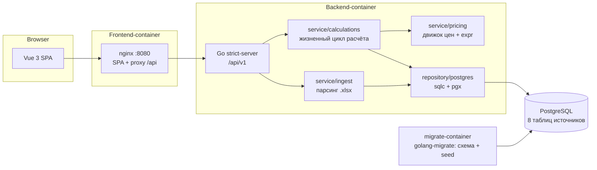

# Архитектура sibur-petrochem-price-service

Сервис расчёта цен на нефтехимическую продукцию: аналитик загружает прогноз
спроса и каталог договорных формул, сервис подбирает формулу для каждой строки,
подставляет котировки и курсы (каскад Факт → ОФ → ППР), считает цену,
даёт расшифровку и ручные правки, собирает сводный документ и выгружает Excel.

Эталон алгоритма — `pricing_pipeline_fixed.py` (корень репозитория). Go-движок
сверен с ним 1:1 приёмочным тестом (статусы и цены на полном демо-наборе).

## Общая схема



Три принципа:

1. **API-first** — `api/openapi.yaml` единственный источник правды контракта.
   Backend-хендлеры и DTO генерируются oapi-codegen (strict-mode), frontend
   типизируется тем же контрактом. Меняем API → сначала правим контракт.
2. **Clean Architecture на бэкенде** — зависимости направлены внутрь:
   `delivery → service → domain ← repository`. Домен не знает ни про HTTP,
   ни про Postgres.
3. **Эталон как спецификация** — поведение движка задаётся python-эталоном
   и фиксируется приёмочным тестом, а не пересказом правил.

## Контракт (api/)

- `api/openapi.yaml` — 18 операций: источники (список, превью, загрузка файла,
  демо-активация), расчёты (создание, прогресс-SSE, KPI, строки, правки),
  формулы (парсинг), сводный документ (участки, экспорт), presence-SSE.
- `api/oapi-codegen.yaml` — генерация `backend/internal/generated/api/server.gen.go`:
  std-http strict-server + модели + embedded-spec. `streamPresence` исключён
  из кодогена (`exclude-operation-ids`) — долгоживущему SSE нужен `http.Flusher`,
  которого strict-обвязка не даёт; эндпоинт реализован вручную, но описан в контракте.
- Кодогенерация: `make api-generate` (или `make gen-all` вместе с sqlc).

## Backend (backend/)

Слои Clean Architecture:

```
internal/
├── domain/              # модели источников/результата + sentinel-ошибки; ничего не импортирует
├── service/
│   ├── pricing/         # движок расчёта (порт эталона)
│   │   └── expr/        # safe-eval выражений формул
│   ├── calculations/    # жизненный цикл расчёта, KPI, правки, сводный документ
│   └── ingest/          # парсинг пользовательских .xlsx
├── repository/postgres/ # чтение/замещение источников (sqlc + pgx)
├── delivery/http/       # strict-хендлеры по доменам + SSE + экспорт xlsx
├── generated/           # api (oapi-codegen) и sqlc — руками не правится
├── config/              # env-конфигурация (PG_DB_*)
└── app/                 # composition root: pgxpool → repo → service → router
```

### Движок расчёта (service/pricing)

Конвейер `Run()` повторяет эталон:

1. **Подбор кандидатов** (`buildMatches`/`matchRow`): для каждой Formula-строки
   ssp ищутся формулы клиента — по материалу напрямую либо через группу M
   (`material_groups` с проверкой окна действия связи). Будущие формулы
   (`period < valid_from`) отсекаются, просроченные остаются как fallback.
2. **Расчёт каждого кандидата** (`calculateCandidate`): компоненты формулы
   активные на период (valid_to растянут до горизонта ssp), котировки и курсы
   через `choose_nearest_version` — минимум |дата − период|, затем ранг версии
   Факт(0) → ОФ(1) → ППР(2), прошлое перед будущим, максимальный tech_load_ts.
   Значения подставляются в выражение, результат конвертируется из валюты
   формулы в валюту строки через курсы к RUB (кросс-курсы — по ZF-идентификаторам).
3. **Выбор победителя** (`selectForKey`): успешный актуальный кандидат
   (material > group_m, свежее created_at/valid_from, min formula_id);
   только просроченные → `calculated_expired`; равноприоритетные →
   `formula_conflict` + requires_review.

Статусы строки: `calculated`, `calculated_expired`, `formula_conflict`,
`component_error`, `invalid_formula`, `no_formula`, `spot_not_calculated`
(+ `manual` после ручной правки). Ошибка одной строки не прерывает расчёт.

### Парсер выражений (service/pricing/expr)

Собственный safe-eval с python-семантикой эталона: операторы `+ - * / % **`,
сравнения, `IF / RND_X / MIN / MAX`, унарный минус внутри мультипликативного
приоритета, python-mod, деление на ноль — ошибка. `RND_X` — коммерческое
округление half-away-from-zero (shopspring/decimal). Имена переменных допускают
`$ € ¥` и цифро-ведущие (`1_13`). Критическая деталь эталона: переменные
с **числовыми именами** («2», «40000») подменяют числовые литералы выражения —
поэтому числовой узел AST хранит исходный текст и перед использованием литерала
проверяет `variables[text]`.

`Analyze()` (переменные/функции без вычисления) обслуживает `POST /formulas/parse`.

### Жизненный цикл расчёта (service/calculations)

- Расчёт **синхронный** и живёт **в памяти процесса**: `Create(period)` грузит
  источники из БД, фильтрует ssp по периоду, гоняет движок, сохраняет результат
  в map. Рестарт бэкенда = расчёты пропали (MVP-компромисс).
- SSE-прогресс — snapshot-событиями: расчёт уже завершён к моменту подписки,
  клиент получает буфер событий и `done`, поток закрывается.
- Ручные правки (`manual-price`, выбор формулы из кандидатов) меняют
  эффективные строки; KPI пересчитываются на лету.
- KPI — 5 канонических из `documents/кпэ_для_отображения.md`: покрытие
  формулами (SPOT исключён), % формул без ошибок, строки с ошибкой расчёта,
  контрольная сумма (Σ цена × объём × курс в RUB / 1e6), % неклассифицированных ошибок.
- Сводный документ: участки аналитиков по расчётам периода, submission
  переводит участок в `joined`.

### Загрузка документов (service/ingest + delivery)

- `POST /sources/{ssp|formulas}/file` — multipart .xlsx (лимит 20 МБ).
- Парсер: первый лист, колонки по нормализованным заголовкам (ssp — английские,
  formulas — русские SAP: «Ключ формулы», «Действительно с»…), даты и как
  excel-serial, и строками. **Строгая валидация**: любая битая строка/дубль/
  отсутствующая колонка → 400 со списком проблем (первые 20), БД не трогается.
- Успех → `ReplaceSsp`/`ReplaceFormulas`: `DELETE` + pgx `COPY` (sqlc `:copyfrom`)
  в одной транзакции.
- Расчёт запрещён (409 `sources_not_loaded`), пока ssp и formulas не загружены
  файлами либо не активирован демо-набор (`POST /sources/demo` помечает
  seed-данные загруженными). Кнопка демо в UI — по флагу сборки `DEMO_ENABLED`.
- 6 справочников (котировки, курсы, компоненты…) в MVP приходят из seed-миграций.

### Presence (delivery/http/presence.go)

`GET /presence/events` — SSE-хаб «одно соединение = один аналитик»: broadcast
числа подключений при connect/disconnect, keep-alive пинг. Реализован вне
strict-сервера (нужен незабуференный flush), в контракте описан.

## База данных

PostgreSQL, схема и данные — исключительно миграциями (golang-migrate),
приложение подключается к готовой БД и **не мигрирует само**:

| Миграция | Содержимое |
|---|---|
| `000001_init` | 6 справочников: formula_components, term_types, quotes, quote_mapping, currency_rates, material_groups |
| `000002_seed` | демо-данные справочников из documents/*.csv |
| `000003_user_sources` | пользовательские таблицы: `ssp` (UNIQUE(row_id, period) — row_id повторяется по месяцам), `formulas` |
| `000004_user_sources_seed` | демо ssp (3076 строк) + formulas (576) |

Доступ — sqlc (генерация из `backend/db/queries/*.sql`, конфиг
`backend/db/sqlc.yaml`) поверх pgx/v5. Движок читает источники целиком в память
на каждый расчёт; замещение при загрузке — транзакционное.

Состояние, живущее **вне БД** (in-memory, сбрасывается рестартом): результаты
расчётов, ручные правки, метки `uploaded_at`, флаг демо-активации, presence.

## Frontend (frontend/)

Vue 3 + TypeScript strict + Pinia + Vite. Пять экранов сценария:
Загрузка → Расчёт (прогресс) → Результаты (таблица + расшифровка DecodePanel +
выбор формулы) → Сводный документ; шапка с живым счётчиком аналитиков.

Ключевая развязка — **сервисный слой за интерфейсом**:

```
экраны / сторы  →  PricingApi (интерфейс)  →  HttpPricingApi  (fetch /api/v1, SSE, xlsx)
                                            ↘  MockPricingApi (детерминированный датасет)
```

- Типы моделей выведены из `api/openapi.yaml` (`src/api/schema.d.ts` → `src/types`).
- DI-точка `services/provide.ts`: по умолчанию HttpPricingApi;
  `VITE_API_MODE=mock` возвращает моки — экраны и сторы не меняются.
- SSE: прогресс расчёта и presence — `EventSource`; поток прогресса закрывается
  клиентом на `done` (иначе EventSource переподключается).
- Сторы Pinia: `sources` (статусы, загрузка файлов, готовность к расчёту),
  `calculation` (id, строки, KPI, правки), `consolidated`.
- Готовность к расчёту вычисляется по `uploaded_at` обоих пользовательских
  источников; бэкенд дублирует проверку (409).

## Развёртывание

`docker-compose.yml`, четыре сервиса:

```
db (postgres, healthcheck)
  └─ migrate (golang-migrate: up всех миграций, одноразовый)
       └─ backend (Go, слушает :8080 внутри сети)
            └─ frontend (nginx :8080 наружу: SPA + proxy /api → backend, SSE без буферизации)
```

- `make run` — весь стек; `make run-fresh` — со сносом volumes;
  `make install-tools` / `make gen-all` — тулинг и кодогенерация в `./bin`.
- Env: `PG_DB_*` (см. `.env.example`), `DEMO_ENABLED` — кнопка демо-набора
  (build-arg фронта).
- Оркестрация — корневой `Makefile` + `Makefiles/*.mk`.

## Тестирование

- **Поведенческие тесты — groat + faker** (паттерн be-platform):
  `main_test.go` (типы Givens/Expects/Responses/Deps/State + newTestContext) +
  `*_cases_test.go`; SUT-вызов в теле теста после цепочки Given/When/Then
  (Then выполняется в t.Cleanup).
- **Приёмка движка**: `pricing/acceptance_test.go` — полный прогон против
  fixture эталона (статусы + цены, tolerance 1e-6).
- Delivery-тесты гоняют реальный `http.Handler` (роутер + strict-обвязка),
  включая multipart-загрузку сгенерированных excelize-фикстур и presence
  через два живых соединения `httptest.Server`.
- Frontend: vitest (компонентные), vue-tsc typecheck; backend: golangci-lint
  (funlen/gocognit/mnd/lll и др., конфиг `backend/.golangci.yml`).

## Осознанные MVP-компромиссы

| Компромисс | Причина / что при росте |
|---|---|
| Расчёты в памяти процесса | буткемп-масштаб; при росте — таблица расчётов + очередь |
| Синхронный расчёт + snapshot-SSE | 3–4k строк считаются за ~0.1 с; стриминг прогресса не нужен |
| Один аналитик («А. Смирнов»), без аутентификации | presence считает соединения; мультитенантность потребует auth |
| Справочники только из seed | пользователь грузит лишь ssp/formulas |
| Период расчёта зашит в UI (2026-06) | демо-сценарий; бэкенд принимает любой период |
